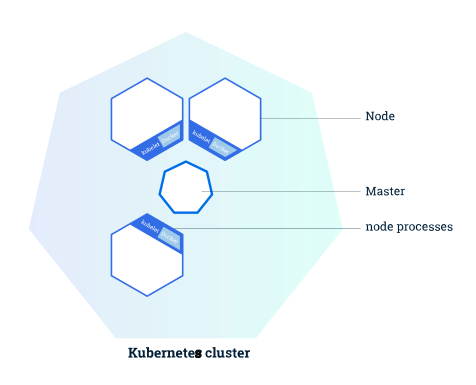

# Kubernetes Clusters
A running Kubernetes cluster contains node agents (kubelet) and a cluster control plane (AKA master), with cluster state backed by a distributed storage system (etcd).

- [Kubernetes Clusters](#kubernetes-clusters)
    - [A Kubernetes cluster consists of two types of resources:](#a-kubernetes-cluster-consists-of-two-types-of-resources)
  - [Cluster Diagram](#cluster-diagram)
  - [Architecture](#architecture)
    - [Cluster control plane (AKA *master*)](#cluster-control-plane-aka-master)
      - [API Server](#api-server)
      - [Cluster state store](#cluster-state-store)
      - [Controller-Manager Server](#controller-manager-server)
      - [Scheduler](#scheduler)
    - [The Kubernetes Node](#the-kubernetes-node)
      - [Kubelet](#kubelet)
      - [Container runtime](#container-runtime)
      - [Kube Proxy](#kube-proxy)
    - [Add-ons and other dependencies](#add-ons-and-other-dependencies)
    - [Federation](#federation)

### A Kubernetes cluster consists of two types of resources:

- The Master coordinates the cluster
- Nodes are the workers that run applications

Kubernetes is a production-grade, open-source platform that orchestrates the placement (scheduling) and execution of application containers within and across computer clusters.

## Cluster Diagram

The *Master* is responsible for managing the cluster. The master coordinates all activities in your cluster, such as scheduling applications, maintaining applications' desired state, scaling applications, and rolling out new updates.

Each node has a Kubelet, which is an agent for managing the node and communicating with the Kubernetes master. The node should also have tools for handling container operations, such as Docker or rkt. A Kubernetes cluster that handles production traffic should have a minimum of three nodes.

Masters manage the cluster and the nodes are used to host the running applications.

When you deploy applications on Kubernetes, you tell the master to start the application containers. The master schedules the containers to run on the cluster's nodes. The nodes communicate with the master using the Kubernetes API, which the master exposes. End users can also use the Kubernetes API directly to interact with the cluster.

A Kubernetes cluster can be deployed on either physical or virtual machines.

## Architecture

A running Kubernetes cluster contains node agents (kubelet) and a cluster control plane (AKA
*master*), with cluster state backed by a distributed storage system
([etcd](https://github.com/coreos/etcd)).

### Cluster control plane (AKA *master*)

The Kubernetes [control plane](https://en.wikipedia.org/wiki/Control_plane) is split 
into a set of components, which can all run on a single *master* node, or can be replicated
in order to support high-availability clusters, or can even be run on Kubernetes itself (AKA
[self-hosted](../cluster-lifecycle/self-hosted-kubernetes.md#what-is-self-hosted)).

Kubernetes provides a REST API supporting primarily CRUD operations on (mostly) persistent resources, which
serve as the hub of its control plane. Kubernetes’s API provides IaaS-like
container-centric primitives such as [Pods](https://kubernetes.io/docs/concepts/workloads/pods/pod/),
[Services](https://kubernetes.io/docs/concepts/services-networking/service/), and 
[Ingress](https://kubernetes.io/docs/concepts/services-networking/ingress/), and also lifecycle APIs to support orchestration
(self-healing, scaling, updates, termination) of common types of workloads, such as 
[ReplicaSet](https://kubernetes.io/docs/concepts/workloads/controllers/replicaset/) (simple fungible/stateless app manager),
[Deployment](https://kubernetes.io/docs/concepts/workloads/controllers/deployment/) (orchestrates updates of
stateless apps), [Job](https://kubernetes.io/docs/concepts/workloads/controllers/jobs-run-to-completion/) (batch), 
[CronJob](https://kubernetes.io/docs/concepts/workloads/controllers/cron-jobs/) (cron), 
[DaemonSet](https://kubernetes.io/docs/concepts/workloads/controllers/daemonset/) (cluster services), and 
[StatefulSet](https://kubernetes.io/docs/concepts/workloads/controllers/statefulset/) (stateful apps).
We deliberately decoupled service naming/discovery and load balancing from application
implementation, since the latter is diverse and open-ended. 

Both user clients and components containing asynchronous controllers interact with the same API resources,
which serve as coordination points, common intermediate representation, and shared state. Most resources 
contain metadata, including [labels](https://kubernetes.io/docs/concepts/overview/working-with-objects/labels/) and 
[annotations](https://kubernetes.io/docs/concepts/overview/working-with-objects/annotations/), fully elaborated desired state (spec),
including default values, and observed state (status). 

Controllers work continuously to drive the actual state towards the desired state, while reporting back the currently observed state for users and for other controllers. 

While the controllers are level-based (as described [here](http://gengnosis.blogspot.com/2007/01/level-triggered-and-edge-triggered.html) and [here](https://hackernoon.com/level-triggering-and-reconciliation-in-kubernetes-1f17fe30333d))
to maximize fault
tolerance, they typically `watch` for changes to relevant resources in order to minimize reaction
latency and redundant work. This enables decentralized and decoupled
[choreography-like](https://en.wikipedia.org/wiki/Service_choreography) coordination without a
message bus. 

#### API Server

The [API server](https://kubernetes.io/docs/admin/kube-apiserver/) serves up the
[Kubernetes API](https://kubernetes.io/docs/concepts/overview/kubernetes-api/). It is intended to be a relatively simple
server, with most/all business logic implemented in separate components or in plug-ins. It mainly
processes REST operations, validates them, and updates the corresponding objects in `etcd` (and
perhaps eventually other stores). Note that, for a number of reasons, Kubernetes deliberately does
not support atomic transactions across multiple resources.

Kubernetes cannot function without this basic API machinery, which includes:
* REST semantics, watch, durability and consistency guarantees, API versioning, defaulting, and
  validation
* Built-in admission-control semantics, synchronous admission-control hooks, and asynchronous
  resource initialization
* API registration and discovery

Additionally, the API server acts as the gateway to the cluster. By definition, the API server
must be accessible by clients from outside the cluster, whereas the nodes, and certainly
containers, may not be. Clients authenticate the API server and also use it as a bastion and
proxy/tunnel to nodes and pods (and services).

#### Cluster state store

All persistent cluster state is stored in an instance of `etcd`. This provides a way to store
configuration data reliably. With `watch` support, coordinating components can be notified very
quickly of changes.

#### Controller-Manager Server

Most other cluster-level functions are currently performed by a separate process, called the
[Controller Manager](https://kubernetes.io/docs/admin/kube-controller-manager/). It performs
both lifecycle functions (e.g., namespace creation and lifecycle, event garbage collection,
terminated-pod garbage collection, cascading-deletion garbage collection, node garbage collection)
and API business logic (e.g., scaling of pods controlled by a 
[ReplicaSet](https://kubernetes.io/docs/concepts/workloads/controllers/replicaset/)).

The application management and composition layer, providing self-healing, scaling, application lifecycle management, service discovery, routing, and service binding and provisioning.

These functions may eventually be split into separate components to make them more easily
extended or replaced.

#### Scheduler

Kubernetes enables users to ask a cluster to run a set of containers. The scheduler
component automatically chooses hosts to run those containers on. 

The scheduler watches for unscheduled pods and binds them to nodes via the `/binding` pod 
subresource API, according to the availability of the requested resources, quality of service
requirements, affinity and anti-affinity specifications, and other constraints.

Kubernetes supports user-provided schedulers and multiple concurrent cluster schedulers,
using the shared-state approach pioneered by 
[Omega](https://research.google.com/pubs/pub41684.html). In addition to the disadvantages of
pessimistic concurrency described by the Omega paper, 
[two-level scheduling models](https://amplab.cs.berkeley.edu/wp-content/uploads/2011/06/Mesos-A-Platform-for-Fine-Grained-Resource-Sharing-in-the-Data-Center.pdf) that hide information from the upper-level
schedulers need to implement all of the same features in the lower-level scheduler as required by
all upper-layer schedulers in order to ensure that their scheduling requests can be satisfied by
available desired resources.

### The Kubernetes Node

The Kubernetes node has the services necessary to run application containers and
be managed from the master systems.

#### Kubelet

The most important and most prominent controller in Kubernetes is the Kubelet, which is the
primary implementer of the Pod and Node APIs that drive the container execution layer. Without
these APIs, Kubernetes would just be a CRUD-oriented REST application framework backed by a
key-value store (and perhaps the API machinery will eventually be spun out as an independent
project). 

Kubernetes executes isolated application containers as its default, native mode of execution, as
opposed to processes and traditional operating-system packages. Not only are application
containers isolated from each other, but they are also isolated from the hosts on which they
execute, which is critical to decoupling management of individual applications from each other and
from management of the underlying cluster physical/virtual infrastructure.

Kubernetes provides [Pods](https://kubernetes.io/docs/concepts/workloads/pods/pod/) that can host multiple
containers and storage volumes as its fundamental execution primitive in order to facilitate
packaging a single application per container, decoupling deployment-time concerns from build-time
concerns, and migration from physical/virtual machines. The Pod primitive is key to glean the
[primary benefits](https://kubernetes.io/docs/concepts/overview/what-is-kubernetes/#why-containers) of deployment on modern
cloud platforms, such as Kubernetes.

API admission control may reject pods or add additional scheduling constraints to them, but
Kubelet is the final arbiter of what pods can and cannot run on a given node, not the schedulers
or DaemonSets. 

Kubelet also currently links in the [cAdvisor](https://github.com/google/cadvisor) resource monitoring
agent.

#### Container runtime

Each node runs a container runtime, which is responsible for downloading images and running containers.

Kubelet does not link in the base container runtime. Instead, we're defining a
[Container Runtime Interface](/contributors/devel/container-runtime-interface.md) to control the
underlying runtime and facilitate pluggability of that layer.
This decoupling is needed in order to maintain clear component boundaries, facilitate testing, and facilitate pluggability.
Runtimes supported today, either upstream or by forks, include at least docker (for Linux and Windows), 
[rkt](https://kubernetes.io/docs/getting-started-guides/rkt/),
[cri-o](https://github.com/kubernetes-incubator/cri-o), and [frakti](https://github.com/kubernetes/frakti).

#### Kube Proxy

The [service](https://kubernetes.io/docs/concepts/services-networking/service/) abstraction provides a way to
group pods under a common access policy (e.g., load-balanced). The implementation of this creates
a virtual IP which clients can access and which is transparently proxied to the pods in a Service.
Each node runs a [kube-proxy](https://kubernetes.io/docs/admin/kube-proxy/) process which programs
`iptables` rules to trap access to service IPs and redirect them to the correct backends. This provides a highly-available load-balancing solution with low performance overhead by balancing
client traffic from a node on that same node.

Service endpoints are found primarily via [DNS](https://kubernetes.io/docs/concepts/services-networking/dns-pod-service/).

### Add-ons and other dependencies

A number of components, called [*add-ons*](https://git.k8s.io/kubernetes/cluster/addons) typically run on Kubernetes
itself:
* [DNS](https://git.k8s.io/kubernetes/cluster/addons/dns)
* [Ingress controller](https://github.com/kubernetes/ingress-gce)
* [Heapster](https://github.com/kubernetes/heapster/) (resource monitoring)
* [Dashboard](https://github.com/kubernetes/dashboard/) (GUI)

### Federation

A single Kubernetes cluster may span multiple availability zones.

However, for the highest availability, we recommend using [cluster federation](../multicluster/federation.md).

[Next Topic: Concepts](CONCEPTS)